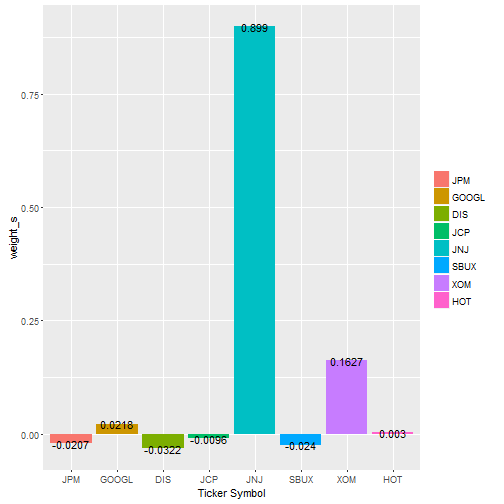
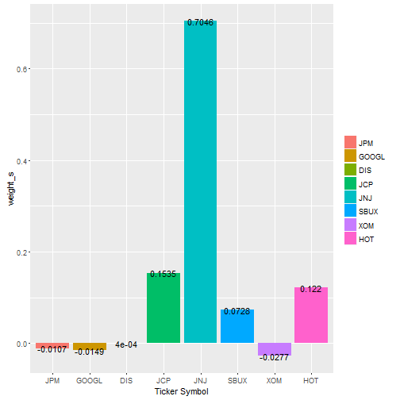
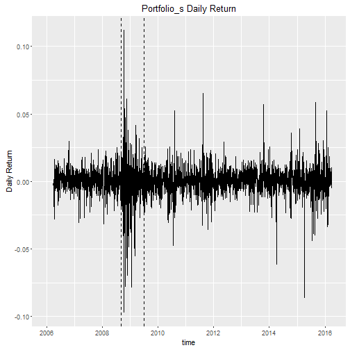
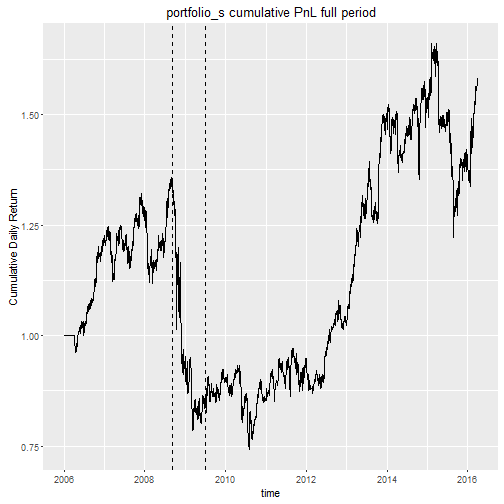
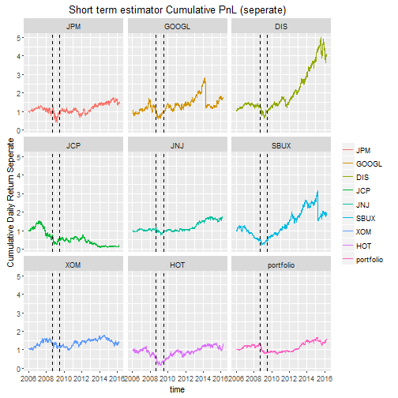
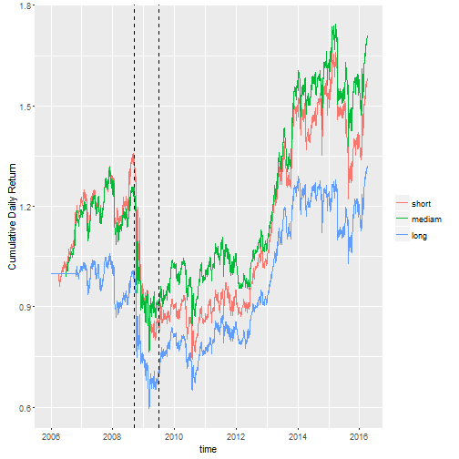

## Modern Portfolio Theory
**Which portfolio is the best?** 

This question is probably as old as the stock-market itself.

People spend a lot of time developing methods and strategies that come close to the "perfect investment", that brings high returns coupled with low risk.

As one of the most important and influential theories dealing this problem, **Modern Portfolio Theory** was developed by Harry Markowitz and published under the title "Portfolio Selection" in the 1952 *Journal of Finance*.


**Let's review some math!**

---

## Basic Notions

* $m$ risky assets: $i= 1, 2, \dots, m$ 
* Single - Period Returns: $\mathbf{R} = [R_{1,t}, R_{2,t}, \dots, R_{m,t}]^T$
* Return calcualated from price: $R_{1,t} = \frac{R_{1,t}-R_{1,t-1}}{R_{1,t-1}}$
* Mean (Expected Returns) and Variance/Covariance of Returns:
 \[
E[\mathbf{R}] = \mathbf{\alpha} = 
\begin{bmatrix}
  \alpha_1   \\
  \vdots     \\
  \alpha_m  
 \end{bmatrix} , \quad
\text{Cov}[\mathbf{R}] = \mathbf{\Sigma} = 
 \begin{bmatrix}
  \Sigma_{1,1}  & \cdots & \Sigma_{1,m} \\
  \vdots    & \ddots & \vdots  \\
  \Sigma_{m,1}  & \cdots & \Sigma_{m,m} 
 \end{bmatrix}
\] 
* Portfolio: $m$ weights indicating the fraction of portfolio wealth held in each asset, $\mathbf{w} = [w_1, \dots, w_m] : \, \sum^m_{i=1} = 1$ (fully invested)

---
## Basic Notions

* Portfolio Return: 
$$R_\mathbf{w} = \mathbf{w}^T \mathbf{R} = \sum^m_{i=1} w_i R_i$$
$$\alpha_{\mathbf{w}} = E[R_{\mathbf{w}}] = \mathbf{w}^T \mathbf{\alpha}$$
$$ \sigma^2_{\mathbf{w}} = \text{var} [R_{\mathbf{w}}] = \mathbf{w}^T \Sigma \mathbf{w}$$
* People are risk averse, we evaluate different portfolios using the mean-variance pair of the portfolio: $(\alpha_{\mathbf{w}},\sigma^2_{\mathbf{w}} )$ with preference for:

    + Higher expected return $\alpha_{\mathbf{w}}$
    + Lower variance $\text{Var}_{\mathbf{w}}$, or its square root $\sigma_{\mathbf{w}}$, standard deviation 

---

## Problem 1 - My Project
### Risk Minimization:

For a given choice of target mean return $\alpha_0$, choose the portfolio $\mathbf{w}$ to
<center>
Minimize: $\frac{1}{2} \mathbf{w}^T \Sigma \; \mathbf{w}$

Subject to: $\mathbf{w}^T  \mathbf{\alpha} = \alpha_0$

$\qquad \qquad  \sum^m_{i=1} = 1$

</center>

### Solution:
Apply the method of *Lagrange multipliers* to the convex minimization problem subject to linear constrains, we can get optimal portfolio weights and variance. 


Matrix operation steps: Check reference [3] 


### Based on this problem, my project is to build and backtest strategies for 8 selected stocks since 2006.

---

## Other Classic Problems
### Expected Return Maximization:
For a given choice of target return variance $\sigma_0^2$, choose the portfolio $\mathbf{w}$ to
<center>
Maximize: $E(R_{\mathbf{w}}) =\mathbf{w}^T \mathbf{\alpha}$

Subject to: $\mathbf{w}^T \Sigma \;  \mathbf{w} = \sigma_0^2$

$\qquad \qquad  \sum^m_{i=1} = 1$

</center>

### Risk Aversion Optimization:
Let $\lambda \geq 0$ denote the *Arrow-Pratt* risk aversion index gauging the trade-off between risk and return. Choose the portfolio $\mathbf{w}$ to

<center>
Maximize: $[E(R_{\mathbf{w}}) - \frac{1}{2} \lambda \text{Var}(R_{\mathbf{w}})] =\mathbf{w}^T \mathbf{\alpha} - \frac{1}{2} \lambda  \mathbf{w}^T \Sigma \; \mathbf{w}$

Subject to: $\sum^m_{i=1} = 1 \qquad \qquad \qquad \qquad \qquad \qquad \qquad \, \,$

</center>

---

## Problem 1 - My Project
### There are many other popular problems involved with more complicated constrains. My project is an application of Problem 1  - Risk Minimization.  

---

## Investment Universe - Data

### Import closing stock price data from Yahoo Finance from 01/01/2006 to 03/31/2016. 


- Select following <span style="color:red">8</span> stocks

- Code is reproducible for different total number, different date range and different companies of stocks chosen 


Company                 | Ticker  | Industry
----------------------  | --------|-------------------
JPMorgan Chase & Co.    | JPM     | Banks
Alphabet Inc            | GOOGL   | Internet
Walt Disney Co          | DIS     | Entertainment
JC Penney Company Inc   | JCP     | Department Stores 
Johnson & Johnson       | JNJ     | Drug Manufacturers 
Starbucks Corporation   | SBUX    | Eateries
Exxon Mobil Corporation | XOM     | Oil & Gas
Starwood Hotels         | HOT     | Lodging

---

## Investment Strategies -Global Setting


* Objective: Minimize Portfolio volatility given a <span style="color:red">15%</span> annual return target

* Porfolio will be fuly invested (sum of weights = <span style="color:red">1</span>)

* Long Short is allowed ( weights between <span style="color:red">200%</span> and <span style="color:red">-200%</span> )

* Portfolio is <span style="color:red">weekly</span> rebalanced


#### Note: all parameters are replaceable in the code 


---

## Estimation of Expected Returns and Covariance
### Expected Returns

### Historic returns are often used to estimate expecetd returns

- Sample Estimator for daily returns with  <span style="color:red">60</span> days of observation for expected returns. 


### Covariance Candidates are:

- Sample Covariance with <span style="color:red">200</span> days of observation for returns, configuration referred as "long term", "long" or "l"

- Sample Covariance with <span style="color:red">120</span> days of observation for returns, configuration referred as "medium term","medium" or "m"

- Sample Covariance with <span style="color:red">60</span> days of observation for returns, configuration referred as "short term", "short" or "s"

#### Note: all parameters are replaceable in the code 

---
## Libraries and Datasets


```r
library(rJava); library(tseries); library(quadprog) 
library(PerformanceAnalytics); library(ggplot2)
library(xlsx); library(data.table);library(xtable)

JPM <- get.hist.quote(instrument="JPM", start="2006-01-01", end="2016-3-31", quote="Close")
GOOGL <- get.hist.quote(instrument="GOOGL", start="2006-01-01", end="2016-3-31", quote="Close")
DIS <- get.hist.quote(instrument="DIS", start="2006-01-01", end="2016-3-31", quote="Close")
JCP <- get.hist.quote(instrument="JCP", start="2006-01-01", end="2016-3-31", quote="Close")
JNJ <- get.hist.quote(instrument="JNJ", start="2006-01-01", end="2016-3-31", quote="Close")
SBUX <- get.hist.quote(instrument="SBUX", start="2006-01-01", end="2016-3-31", quote="Close")
XOM <- get.hist.quote(instrument="XOM", start="2006-01-01", end="2016-3-31", quote="Close")
HOT <- get.hist.quote(instrument="HOT", start="2006-01-01", end="2016-3-31", quote="Close")


price_raw <- cbind(JPM, GOOGL, DIS, JCP, JNJ, SBUX, XOM, HOT)
```

---
---
## Daily Returns


```r
return_daily <- diff(price_raw)/lag(price_raw, k=-1)
colnames(return_daily) <- c("JPM", "GOOGL", "DIS", "JCP", "JNJ", "SBUX", "XOM", "HOT")

# head(return_daily, 4)
```

<!-- html table generated in R 3.2.4 by xtable 1.8-2 package -->
<!-- Tue Jun 21 15:57:49 2016 -->
<table border=1>
<tr> <th>  </th> <th> date </th> <th> JPM </th> <th> GOOGL </th> <th> DIS </th> <th> JCP </th> <th> JNJ </th> <th> SBUX </th> <th> XOM </th> <th> HOT </th>  </tr>
  <tr> <td align="right"> 1 </td> <td> 2006-01-04 </td> <td align="right"> -0.01418 </td> <td align="right"> 0.02300 </td> <td align="right"> -0.01680 </td> <td align="right"> 0.01382 </td> <td align="right"> 0.01541 </td> <td align="right"> 0.02592 </td> <td align="right"> 0.00171 </td> <td align="right"> -0.00906 </td> </tr>
  <tr> <td align="right"> 2 </td> <td> 2006-01-05 </td> <td align="right"> 0.00303 </td> <td align="right"> 0.01348 </td> <td align="right"> 0.01751 </td> <td align="right"> -0.03180 </td> <td align="right"> -0.00415 </td> <td align="right"> -0.00189 </td> <td align="right"> -0.00495 </td> <td align="right"> 0.00142 </td> </tr>
  <tr> <td align="right"> 3 </td> <td> 2006-01-06 </td> <td align="right"> 0.00705 </td> <td align="right"> 0.03196 </td> <td align="right"> 0.01352 </td> <td align="right"> 0.01047 </td> <td align="right"> 0.00449 </td> <td align="right"> 0.00032 </td> <td align="right"> 0.01973 </td> <td align="right"> 0.00850 </td> </tr>
  <tr> <td align="right"> 4 </td> <td> 2006-01-09 </td> <td align="right"> 0.01624 </td> <td align="right"> 0.00266 </td> <td align="right"> 0.01051 </td> <td align="right"> 0.00196 </td> <td align="right"> 0.00623 </td> <td align="right"> -0.01012 </td> <td align="right"> -0.00050 </td> <td align="right"> 0.00703 </td> </tr>
   </table>


---
## Solve the optimization problem


```r
n1 <- nrow(return_daily)
n2 <- ncol(return_daily)
return_daily <- cbind(return_daily, portfolio=rep(NA,n1))
weight <- matrix(NA, nrow = n1, ncol = n2)
i = 1 + 60  # short: i = 1 + 60 
             # medium: i = 1 + 120
             # long:i = 1 + 200
             # If you don't want to observe from 2006-01-04
             # change 1 to b <- which(format(index(return_daily), "%Y-%m-%d") == '2008-01-05'
```


---

## Solve the optimization problem


```r
while (i <= n1){
  return_expect <- colMeans(return_daily[(i-60):(i-1), 1:n2], na.rm=TRUE) 
          # 60 days of observation for expected returns, fixed in my project, can change if you desire different estimator
  Dmat <- cov(return_daily[(i-60):(i-1), 1:n2], use = "complete.obs") 
          # Sample Covariance with 60 days of observation for returns, change to m: 120; l: 200
  Amat <- cbind(1, return_expect, diag(1,n2), diag(-1,n2))
  target <- 0.15 / 250
         # target yearly return 15%, fixed in my project, can change if you desire different constrain
  bvec <- c(1, target, -2+rep(0,n2), -2+rep(0,n2))
  dvec <- rep(0,n2)
  opt_sol <- solve.QP(Dmat,dvec,Amat,bvec, meq=2, factorized=FALSE)$solution
         # solve the optimization problem
  weight[i+0:min(4,n1-i), ] <- matrix(rep(opt_sol, min(5,n1-i+1)), ncol=n2, byrow=T)
         # record weight for each asset
  return_daily[i+0:min(4,n1-i), n2+1] <- return_daily[i+0:min(4,n1-i), 1:n2] %*% opt_sol
         # record new daily return for each asset and portfolio overall
  i = i + 5 
         # weekly rebalance portfolio, adjust weight per 5 trading day
         # fixed in my project, can change if you desire different condition
}
```

---

## Record Solution: short-term estimator

- Record new daily return for each asset and portfolio overall

```r
daily_s <- return_daily

# tail(daily_s,2)
```


<!-- html table generated in R 3.2.4 by xtable 1.8-2 package -->
<!-- Tue Jun 21 15:59:41 2016 -->
<table border=1>
<tr> <th>  </th> <th> date </th> <th> JPM </th> <th> GOOGL </th> <th> DIS </th> <th> JCP </th> <th> JNJ </th> <th> SBUX </th> <th> XOM </th> <th> HOT </th> <th> portfolio </th>  </tr>
  <tr> <td align="right"> 1 </td> <td> 2012-01-03 </td> <td align="right"> 0.05203 </td> <td align="right"> 0.03021 </td> <td align="right"> 0.02160 </td> <td align="right"> -0.00370 </td> <td align="right"> 0.00457 </td> <td align="right"> -0.01565 </td> <td align="right"> 0.01463 </td> <td align="right"> 0.03044 </td> <td align="right"> 0.00041 </td> </tr>
  <tr> <td align="right"> 2 </td> <td> 2012-01-04 </td> <td align="right"> -0.00086 </td> <td align="right"> 0.00431 </td> <td align="right"> 0.01410 </td> <td align="right"> -0.00314 </td> <td align="right"> -0.00607 </td> <td align="right"> 0.01943 </td> <td align="right"> 0.00023 </td> <td align="right"> 0.00020 </td> <td align="right"> -0.01102 </td> </tr>
   </table>


- extract portfolio daily return


```r
portfolio_s <- return_daily[,"portfolio"]
```


---

## Record Solution: short-term estimator

- record weight for each asset


```r
weight_s <- data.frame(weight)
rownames(weight_s) <- as.character(index(daily_s))
colnames(weight_s) <- colnames(daily_s)[1:8]
```


In the following page, we will check our global setting:


  
1. full investment: sum of the weight = 1

2. portfolio is weekly balanced
 
  


---

## Record Solution: short-term estimator

Fully invested: sum of weight = 1


```r
sum(weight_s[100,1:8])
```

```
## [1] 1
```

```r
sum(weight_s[200,1:8])
```

```
## [1] 1
```


---

## Record Solution: short-term estimator

weight adjusted every five days


```r
# tail(weight_s, 9)
```

<!-- html table generated in R 3.2.4 by xtable 1.8-2 package -->
<!-- Tue Jun 21 16:11:59 2016 -->
<table border=1>
<tr> <th>  </th> <th> date </th> <th> JPM </th> <th> GOOGL </th> <th> DIS </th> <th> JCP </th> <th> JNJ </th> <th> SBUX </th> <th> XOM </th> <th> HOT </th>  </tr>
  <tr> <td align="right"> 1 </td> <td> 2016-03-18 </td> <td align="right"> -0.10548 </td> <td align="right"> 0.29112 </td> <td align="right"> 0.18929 </td> <td align="right"> 0.04125 </td> <td align="right"> 0.62734 </td> <td align="right"> -0.13745 </td> <td align="right"> 0.11437 </td> <td align="right"> -0.02044 </td> </tr>
  <tr> <td align="right"> 2 </td> <td> 2016-03-21 </td> <td align="right"> -0.10548 </td> <td align="right"> 0.29112 </td> <td align="right"> 0.18929 </td> <td align="right"> 0.04125 </td> <td align="right"> 0.62734 </td> <td align="right"> -0.13745 </td> <td align="right"> 0.11437 </td> <td align="right"> -0.02044 </td> </tr>
  <tr> <td align="right"> 3 </td> <td> 2016-03-22 </td> <td align="right"> -0.07360 </td> <td align="right"> 0.28233 </td> <td align="right"> 0.24746 </td> <td align="right"> 0.03308 </td> <td align="right"> 0.65960 </td> <td align="right"> -0.16801 </td> <td align="right"> 0.05094 </td> <td align="right"> -0.03180 </td> </tr>
  <tr> <td align="right"> 4 </td> <td> 2016-03-23 </td> <td align="right"> -0.07360 </td> <td align="right"> 0.28233 </td> <td align="right"> 0.24746 </td> <td align="right"> 0.03308 </td> <td align="right"> 0.65960 </td> <td align="right"> -0.16801 </td> <td align="right"> 0.05094 </td> <td align="right"> -0.03180 </td> </tr>
  <tr> <td align="right"> 5 </td> <td> 2016-03-24 </td> <td align="right"> -0.07360 </td> <td align="right"> 0.28233 </td> <td align="right"> 0.24746 </td> <td align="right"> 0.03308 </td> <td align="right"> 0.65960 </td> <td align="right"> -0.16801 </td> <td align="right"> 0.05094 </td> <td align="right"> -0.03180 </td> </tr>
  <tr> <td align="right"> 6 </td> <td> 2016-03-28 </td> <td align="right"> -0.07360 </td> <td align="right"> 0.28233 </td> <td align="right"> 0.24746 </td> <td align="right"> 0.03308 </td> <td align="right"> 0.65960 </td> <td align="right"> -0.16801 </td> <td align="right"> 0.05094 </td> <td align="right"> -0.03180 </td> </tr>
  <tr> <td align="right"> 7 </td> <td> 2016-03-29 </td> <td align="right"> -0.07360 </td> <td align="right"> 0.28233 </td> <td align="right"> 0.24746 </td> <td align="right"> 0.03308 </td> <td align="right"> 0.65960 </td> <td align="right"> -0.16801 </td> <td align="right"> 0.05094 </td> <td align="right"> -0.03180 </td> </tr>
  <tr> <td align="right"> 8 </td> <td> 2016-03-30 </td> <td align="right"> -0.05966 </td> <td align="right"> 0.29868 </td> <td align="right"> 0.24171 </td> <td align="right"> 0.03069 </td> <td align="right"> 0.61849 </td> <td align="right"> -0.17080 </td> <td align="right"> 0.06497 </td> <td align="right"> -0.02408 </td> </tr>
  <tr> <td align="right"> 9 </td> <td> 2016-03-31 </td> <td align="right"> -0.05966 </td> <td align="right"> 0.29868 </td> <td align="right"> 0.24171 </td> <td align="right"> 0.03069 </td> <td align="right"> 0.61849 </td> <td align="right"> -0.17080 </td> <td align="right"> 0.06497 </td> <td align="right"> -0.02408 </td> </tr>
   </table>


---

## Visualize Solution: short-term estimator

### Pick some dates to visuaize weight under each stock on a particular date
- can change to the following "2008-09-15" to any trading day


```r
weight_s <- setDT(weight_s, keep.rownames = TRUE)[]
bar <- subset(weight_s, rn == "2008-09-15")
bar_melt <- melt(bar, id.vars="rn")

ggplot(bar_melt, aes(x=variable, y=value)) + 
  geom_bar(stat="identity", position = "identity",aes(fill=variable)) +
  geom_text(aes(x=variable, y=value, label=round(value, digits = 4))) +
  labs(x="Ticker Symbol",y="weight_s") +
  theme(legend.title=element_blank())
```

--- 

## Visualize Solution: short-term estimator

- 2008-09-15： when Lehman Brothers filed bankruptcy



---


## Visualize Solution: short-term estimator

- 2015-12-16： when Fed Raises Key Interest Rate for First Time in Almost a Decade



---


## Visualize Solution: short-term estimator


```r
autoplot(daily_s$portfolio[1:2577], main="Portfolio_s Daily Return", facets=NULL) + 
    xlab("time") + ylab("Daily Return") + 
    geom_vline(xintercept=as.numeric(index(daily_s[c(674,879),])), linetype="dashed")
```



---

## Visualize Solution: short-term estimator

### Some observations: 

- During crisis period (2008-2010), return volatility is much lager than usual.

- For a extreme volatility in one day, it is usually caused by company splitted its stock, the price became half instantly


---


## Record Solution: short-term estimator

Graphs about daily return is not natural, investors feel comfortable to look at Cumulative PnL (returns)


### Record Cumulative returns


```r
cummu_s <- daily_s
for (j in 1:n1)
  cummu_s[j, ] <- apply(daily_s[1:j, ], 2, Return.cumulative) + 1

autoplot(cummu_s$portfolio[1:2577], main="portfolio_s cumulative PnL full period", facets=NULL) + 
      xlab("time") + ylab("Cumulative Daily Return") +
     geom_vline(xintercept=as.numeric(index(cummu_s[c(674,879),])), linetype="dashed")
```


---

## Visualize Solution: short-term estimator



---

## Visualize Solution: short-term estimator



---


## Same steps for medium and long term estimator

### Now we can apply the same methods by using medium and long term estimator.

### Recall:
- Sample Covariance with <span style="color:red">200</span> days of observation for returns, configuration referred as "long term", "long" or "l"

- Sample Covariance with <span style="color:red">120</span> days of observation for returns, configuration referred as "medium term","medium" or "m"

- Sample Covariance with <span style="color:red">60</span> days of observation for returns, configuration referred as "short term", "short" or "s"


---

## Comparison between estimators


```r
cummu <- cbind(cummu_s[,"portfolio"], cummu_m[,"portfolio"], cummu_l[,"portfolio"])
colnames(cummu) <- c("short","mediam","long")


cummu <- data.frame(cummu)
cummu_date <- setDT(cummu, keep.rownames = TRUE)[]
cummu_melt <- melt(cummu_date, id.vars="rn")
cummu_melt$rn <- as.Date(cummu_melt$rn)
```

---


## Comparison between estimators



### Is it the end of our story?

---

## Comparison between estimators

- Crisis:
     + Begin of the crisis: 2008 Sep 7, The Federal Housing Finance Agency (FHFA) places Fannie Mae and Freddie Mac in government conservatorship.  A week later, Lehman Brothers filed bankruptcy.  
     + It ended in June 2009, according to the U.S. National Bureau of Economic Research (NBER)

- data set (return_daily)
     + Before crisis: return_daily[,1:674]
     + During crisis: return_daily[,675:878]
     + After crisis: return_daily[,879:1512]
 
- Nobody evaluates a portfolio by is just looking at the cumulative PnL

---

## Performance Indicators

Notation                 | Definition  | Reference 
----------------------   | --------    |-------------------
mean_daily_return        | average of daily return         | 
mean_daily_return_annual | annualized  average of daily return     | mean_daily_return * 252
min_daily_return         | minimum daily return         | 
max_daily_return         | maximum daily return        | 
volatility               | standard deviation of daily return         | [click](http://www.investopedia.com/terms/v/volatility.asp)
volatility_annual        | annualized standard deviation of daily return         | volatility * $\sqrt{252}$
Sharpe_ratio             | Sharpe Ratio    | [click](http://www.investopedia.com/terms/s/sharperatio.asp)
Sharpe_ratio_annual      | annualized Sharpe Ratio     | [click](http://www.iijournals.com/doi/abs/10.3905/jpm.1994.409501)
Sortino_ratio            | Sortino Ratio    | [click](http://www.investopedia.com/terms/s/sortinoratio.asp)
Skewness_Kurtosis_ratio  | Skewness divide Kurtosis     | [click](https://www.amazon.com/Practical-Portfolio-Performance-Measurement-Attribution/dp/0470059281?ie=UTF8&*Version*=1&*entries*=0)
Modifed_VaR              | Modified Value at Risk     | [click](https://www.evestment.com/resources/investment-statistics-guide/modified-value-at-risk)
Modifed_VaR_annual       | annualized Modified Value at Risk     | 
Max_drawdown             | Maximum Drawdown     | [click](http://www.investopedia.com/terms/m/maximum-drawdown-mdd.asp)

 


---

## Performance Report: Before the Crisis


```r
library(xtable)
print(xtable(report_b,digits=5), type = "html")
```

<!-- html table generated in R 3.2.4 by xtable 1.8-2 package -->
<!-- Tue Jun 21 16:03:30 2016 -->
<table border=1>
<tr> <th>  </th> <th> before crisis_s </th> <th> before crisis_m </th> <th> before crisis_l </th> <th> vote </th>  </tr>
  <tr> <td align="right"> mean_daily_return </td> <td align="right"> 0.00052 </td> <td align="right"> 0.00045 </td> <td align="right"> 0.00005 </td> <td align="right">  </td> </tr>
  <tr> <td align="right"> mean_daily_return_annual </td> <td align="right"> 0.13169 </td> <td align="right"> 0.11281 </td> <td align="right"> 0.01282 </td> <td align="right">      1 </td> </tr>
  <tr> <td align="right"> min_daily_return </td> <td align="right"> -0.03136 </td> <td align="right"> -0.03578 </td> <td align="right"> -0.03955 </td> <td align="right">      1 </td> </tr>
  <tr> <td align="right"> max_daily_return </td> <td align="right"> 0.02967 </td> <td align="right"> 0.02840 </td> <td align="right"> 0.02276 </td> <td align="right">      1 </td> </tr>
  <tr> <td align="right"> volatility </td> <td align="right"> 0.00806 </td> <td align="right"> 0.00804 </td> <td align="right"> 0.00816 </td> <td align="right">  </td> </tr>
  <tr> <td align="right"> volatility_annual </td> <td align="right"> 0.12788 </td> <td align="right"> 0.12758 </td> <td align="right"> 0.12947 </td> <td align="right">      2 </td> </tr>
  <tr> <td align="right"> Sharpe_ratio </td> <td align="right"> 0.06487 </td> <td align="right"> 0.05570 </td> <td align="right"> 0.00624 </td> <td align="right">  </td> </tr>
  <tr> <td align="right"> Sharpe_ratio_annual </td> <td align="right"> 1.02772 </td> <td align="right"> 0.86472 </td> <td align="right"> 0.03428 </td> <td align="right">      1 </td> </tr>
  <tr> <td align="right"> Sortino_ratio </td> <td align="right"> -0.01311 </td> <td align="right"> -0.02549 </td> <td align="right"> -0.08548 </td> <td align="right">      1 </td> </tr>
  <tr> <td align="right"> Skewness_Kurtosis_ratio </td> <td align="right"> -0.06596 </td> <td align="right"> -0.08434 </td> <td align="right"> -0.13038 </td> <td align="right">  </td> </tr>
  <tr> <td align="right"> Modifed_VaR </td> <td align="right"> -0.01314 </td> <td align="right"> -0.01337 </td> <td align="right"> -0.01447 </td> <td align="right">  </td> </tr>
  <tr> <td align="right"> Modifed_VaR_annual </td> <td align="right"> -0.01314 </td> <td align="right"> -0.01337 </td> <td align="right"> -0.01447 </td> <td align="right">      3 </td> </tr>
  <tr> <td align="right"> Max_drawdown </td> <td align="right"> 0.15402 </td> <td align="right"> 0.17585 </td> <td align="right"> 0.18136 </td> <td align="right">      1 </td> </tr>
   </table>


---

## Before the Crisis:
- Short-term estimator works the best
     + highest daily return: closest to 15% target
     + annualized Shape Ratio is greater than 1

- volatility
     + medium estimator has smallest volatility
     + volatility from short estimator is about the same 

---

## Performance Report: During the Crisis

<!-- html table generated in R 3.2.4 by xtable 1.8-2 package -->
<!-- Tue Jun 21 16:03:30 2016 -->
<table border=1>
<tr> <th>  </th> <th> during crisis_s </th> <th> during crisis_m </th> <th> during crisis_l </th> <th> vote </th>  </tr>
  <tr> <td align="right"> mean_daily_return </td> <td align="right"> -0.00196 </td> <td align="right"> -0.00126 </td> <td align="right"> -0.00145 </td> <td align="right">  </td> </tr>
  <tr> <td align="right"> mean_daily_return_annual </td> <td align="right"> -0.49460 </td> <td align="right"> -0.31791 </td> <td align="right"> -0.36456 </td> <td align="right">      2 </td> </tr>
  <tr> <td align="right"> min_daily_return </td> <td align="right"> -0.09695 </td> <td align="right"> -0.09400 </td> <td align="right"> -0.09198 </td> <td align="right">      3 </td> </tr>
  <tr> <td align="right"> max_daily_return </td> <td align="right"> 0.11205 </td> <td align="right"> 0.11263 </td> <td align="right"> 0.11630 </td> <td align="right">      3 </td> </tr>
  <tr> <td align="right"> volatility </td> <td align="right"> 0.02366 </td> <td align="right"> 0.02383 </td> <td align="right"> 0.02336 </td> <td align="right">  </td> </tr>
  <tr> <td align="right"> volatility_annual </td> <td align="right"> 0.37553 </td> <td align="right"> 0.37823 </td> <td align="right"> 0.37084 </td> <td align="right">      3 </td> </tr>
  <tr> <td align="right"> Sharpe_ratio </td> <td align="right"> -0.08297 </td> <td align="right"> -0.05295 </td> <td align="right"> -0.06193 </td> <td align="right">  </td> </tr>
  <tr> <td align="right"> Sharpe_ratio_annual </td> <td align="right"> -1.15087 </td> <td align="right"> -0.85277 </td> <td align="right"> -0.94799 </td> <td align="right">      2 </td> </tr>
  <tr> <td align="right"> Sortino_ratio </td> <td align="right"> -0.13586 </td> <td align="right"> -0.10435 </td> <td align="right"> -0.11782 </td> <td align="right">      2 </td> </tr>
  <tr> <td align="right"> Skewness_Kurtosis_ratio </td> <td align="right"> -0.03721 </td> <td align="right"> 0.02628 </td> <td align="right"> 0.05161 </td> <td align="right">  </td> </tr>
  <tr> <td align="right"> Modifed_VaR </td> <td align="right"> -0.04056 </td> <td align="right"> -0.03733 </td> <td align="right"> -0.03515 </td> <td align="right">  </td> </tr>
  <tr> <td align="right"> Modifed_VaR_annual </td> <td align="right"> -0.04056 </td> <td align="right"> -0.03733 </td> <td align="right"> -0.03515 </td> <td align="right">      1 </td> </tr>
  <tr> <td align="right"> Max_drawdown </td> <td align="right"> 0.41948 </td> <td align="right"> 0.39171 </td> <td align="right"> 0.40982 </td> <td align="right">      2 </td> </tr>
   </table>


---

## During the Crisis:
- medium and long term estimator work better than short
     + medium estimator has highest return: though it is negative, far from our target
     + long term estimator has smallest volatility
     + medium estimator has better result in Shape Ratio, Sortino ratio and Maximum Drawdown

- Note: the portfolio during crisis has negative return. 

---

## Performance Report: After the Crisis


<!-- html table generated in R 3.2.4 by xtable 1.8-2 package -->
<!-- Tue Jun 21 16:03:30 2016 -->
<table border=1>
<tr> <th>  </th> <th> after crisis_s </th> <th> after crisis_m </th> <th> after crisis_l </th> <th> vote </th>  </tr>
  <tr> <td align="right"> mean_daily_return </td> <td align="right"> 0.00020 </td> <td align="right"> 0.00026 </td> <td align="right"> 0.00033 </td> <td align="right">  </td> </tr>
  <tr> <td align="right"> mean_daily_return_annual </td> <td align="right"> 0.05022 </td> <td align="right"> 0.06577 </td> <td align="right"> 0.08299 </td> <td align="right">      3 </td> </tr>
  <tr> <td align="right"> min_daily_return </td> <td align="right"> -0.04767 </td> <td align="right"> -0.04425 </td> <td align="right"> -0.04489 </td> <td align="right">      2 </td> </tr>
  <tr> <td align="right"> max_daily_return </td> <td align="right"> 0.06541 </td> <td align="right"> 0.05727 </td> <td align="right"> 0.05206 </td> <td align="right">      1 </td> </tr>
  <tr> <td align="right"> volatility </td> <td align="right"> 0.01045 </td> <td align="right"> 0.01003 </td> <td align="right"> 0.01001 </td> <td align="right">  </td> </tr>
  <tr> <td align="right"> volatility_annual </td> <td align="right"> 0.16582 </td> <td align="right"> 0.15928 </td> <td align="right"> 0.15898 </td> <td align="right">      3 </td> </tr>
  <tr> <td align="right"> Sharpe_ratio </td> <td align="right"> 0.01908 </td> <td align="right"> 0.02601 </td> <td align="right"> 0.03288 </td> <td align="right">  </td> </tr>
  <tr> <td align="right"> Sharpe_ratio_annual </td> <td align="right"> 0.22428 </td> <td align="right"> 0.34241 </td> <td align="right"> 0.45858 </td> <td align="right">      3 </td> </tr>
  <tr> <td align="right"> Sortino_ratio </td> <td align="right"> -0.05314 </td> <td align="right"> -0.04639 </td> <td align="right"> -0.03757 </td> <td align="right">      3 </td> </tr>
  <tr> <td align="right"> Skewness_Kurtosis_ratio </td> <td align="right"> 0.03770 </td> <td align="right"> 0.01298 </td> <td align="right"> 0.02145 </td> <td align="right">  </td> </tr>
  <tr> <td align="right"> Modifed_VaR </td> <td align="right"> -0.01526 </td> <td align="right"> -0.01525 </td> <td align="right"> -0.01517 </td> <td align="right">  </td> </tr>
  <tr> <td align="right"> Modifed_VaR_annual </td> <td align="right"> -0.01526 </td> <td align="right"> -0.01525 </td> <td align="right"> -0.01517 </td> <td align="right">      1 </td> </tr>
  <tr> <td align="right"> Max_drawdown </td> <td align="right"> 0.20524 </td> <td align="right"> 0.19178 </td> <td align="right"> 0.22438 </td> <td align="right">      2 </td> </tr>
   </table>


---

## After the Crisis:

- Long-term estimator works the best
     + highest daily return
     + lowest volatility
     + better result in Shape Ratio and Sortino ratio 


---

## Summary

- Same estimation method would have different performances under different market enviroment.

- When I write the code, I tried to make it more reproduceble; you may simply change/add/remove the ticker symbols, change the number of days for estimators, or adjust the time period, to create your own portfolio and visualization.

- Next step:
     + Maybe a shiny app ?
     + Make expected return estimator fancier: currently I am using return in previous 60 trading days to estimate, this naive attempt can be replaced by many other techniques

---

## Reference
1. http://www.investopedia.com/articles/06/mpt.asp#ixzz4B2w779uJ 
2. http://www.efalken.com/LowVolClassics/markowitz_JF1952.pdf
3. http://ocw.mit.edu/courses/mathematics/18-s096-topics-in-mathematics-with-applications-in-finance-fall-2013/lecture-notes/MIT18_S096F13_lecnote14.pdf

---

## The End


<script type="text/x-mathjax-config">
   MathJax.Hub.Config({  "HTML-CSS": { minScaleAdjust: 125, availableFonts: [] }  });
</script>
